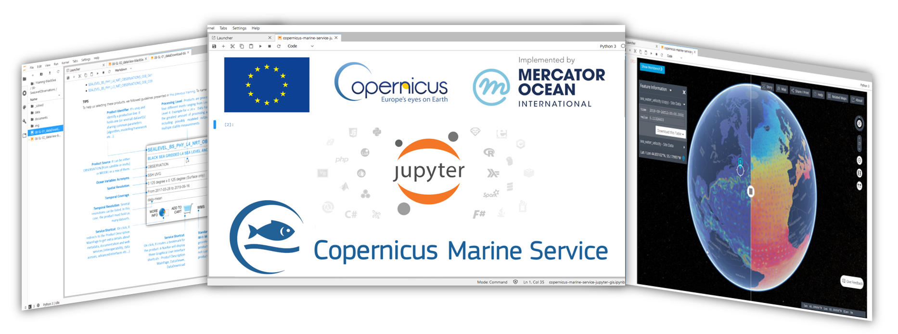

# Copernicus Marine Notebook Gallery

A gallery of Jupyter Notebooks and more, dedicated to Copernicus Marine Service (https://marine.copernicus.eu) and Mercator Ocean International activities (https://www.mercator-ocean.fr/en/).

**Credits**: E.U. Copernicus Marine Service Information

## How to Use these Notebooks
- Browse and read a notebook by clicking on its title
- Run the code (locally) using notebook available in this repository (see [Software](#software) section hereafter)
- Launch a live JupyterLab server for notebooks of your interest by clicking on: `[LiveCode]`
- Become a Coperninus Member (see [Community](#join-the-community) section hereafter) to unlock all features (persistent JupyterHub session etc)

## Table of Contents
1. **Validation**
   1. [A view on the ocean : the physical or the statistical view](./01_11_CMEMS_handson_CLASS4.ipynb)
1. **Global Ocean Modeling**
   1. [Dive into a 3D Virtual Ocean: Interannual variability of the Leeuwin current](./01_31_CMEMS_handson_DIVEp1.ipynb) - [**`[LiveCode]`**](https://tiny.cc/copernicus-nbg-01_31)
   2. [Dive into a 3D Virtual Ocean: Assimilating altimetry in a 3D model](./01_34_CMEMS_handson_DIVEp4.ipynb) - [**`[LiveCode]`**](https://tiny.cc/20210528)
1. **Sea Surface Temperature**
   1. [Subset, Download, Read, Convert, Plot NetCDF Files over Global Ocean](./10-01-Subset-Download-Read-Convert-Plot-NetCDF-files-over-Global-Ocean.ipynb) - [**`[LiveCode]`**](https://tiny.cc/20200527)
 
## Join the community

Get in touch!
- Create your [Copernicus Marine Account](https://resources.marine.copernicus.eu/?option=com_sla)
- Chat in our [Copernicus Marine ChatRoom - Widget Bottom Right](https://marine.copernicus.eu)
- Contact our [Copernicus Human Service Support](https://marine.copernicus.eu/contact)
- Join our [training workshops](https://marine.copernicus.eu/events) and improve your skills from our [Copernicus JupyterLab](https://jupyterhub-cmems.mercator-ocean.fr/)
- (re)Tweet y/our [Copernicus Stories](https://twitter.com/cmems_eu)
- Watch [our videos](https://www.youtube.com/channel/UC71ceOVy7WtVC7F04BKoEew)

## About
`WIP`
## Software
`WIP`
## Licence
`WIP`
